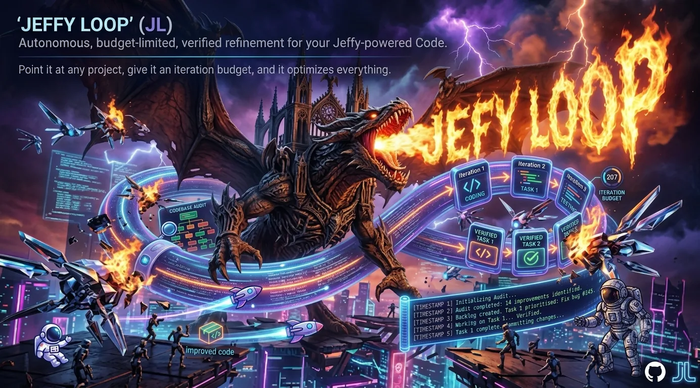

<div align="center">

[](https://github.com/lenamonj/jeffy-loop/actions/workflows/validate.yml)
[](https://claude.com/claude-code)

[](https://claude.ai)



# Jeffy Loop [](LICENSE)

**Point it at a project. Give it a budget. Come back to a better codebase and a report.**

</div>

Jeffy Loop is an autonomous improvement loop for Claude Code that works on your codebase the way a disciplined principal engineer would: audit first, prioritize by real impact, fix one verified task at a time, and stop when the job is actually done.

Run `/jeffy 10` in any project and walk away. Jeffy audits every quality dimension that applies, writes a backlog where every task carries a runnable acceptance check, then burns through it - one task per iteration, each one verified, each one checkpointed. When it finishes, it tells you exactly what changed, what it couldn't do, and what needs your decision.

<div align="center">


<sub>The head-to-head vs a raw prompt loop. Every row is a guarantee you can verify in the code: the engine is <code>skills/jeffy/hooks/stop-hook.sh</code>, the discipline is <code>skills/jeffy/references/iteration-prompt.txt</code>, and the receipts from real runs live under <a href="evals/"><code>evals/</code></a>. <a href="media/jeffy-vs-raw-loop.mp4">Watch in HD</a>.</sub>

</div>

Jeffy Loop descends from the [Ralph technique](https://ghuntley.com/ralph/), Geoffrey Huntley's insight that a coding agent re-fed one prompt in a loop compounds into real work. The comparison above is engine versus method: the raw loop is the engine pattern Jeffy is built on, and Jeffy is the engineering method wrapped around it. The method itself distills what the people running loops at scale have published - Anthropic's [Claude Code best practices](https://code.claude.com/docs/en/best-practices) and [Boris Cherny's public workflow](https://x.com/bcherny/status/2007179832300581177): give the agent a check it can run, one task at a time, promote every hard-won lesson into a file the next run reads, and prefer small fresh-context runs over one long one.

## Why Jeffy

- **An engineer's judgment, not a linter's.** Every run starts from a real audit - architecture, correctness, security, testing, error handling, performance, accessibility, developer experience, and more - and every finding becomes a prioritized task with a concrete acceptance check. Evidence over assertion: a finding exists only if the loop can point at it.

- **It cannot wreck your repo.** Every iteration ends in a local checkpoint commit. A repo-level verify gate runs every iteration, and an iteration that breaks the project is reverted on the spot. Nothing is ever pushed, no branches are created. Review with `git log`, revert any single iteration, squash the run when you're happy.

- **It doesn't invent problems.** Severity is judged against a declared operating envelope - your project's real input surfaces, not imagined attackers. Out-of-envelope findings can't inflate the backlog, and only you can widen the envelope: the loop files a proposal and moves on.

- **Done means done.** The loop converges only when a full fresh audit finds zero High and zero Medium findings *and* the backlog is empty - every Low either fixed or explicitly declined with a reason. No trail of "minor" issues quietly left behind.

- **It knows when to stop.** Budget spent, convergence reached, progress stalled, or a decision only you can make - the loop ends itself and says why, instead of burning budget spinning.

- **Every run ends with a report.** Iterations used, tasks closed with severities, the run's diffstat, anything blocked, and decisions waiting on you. An append-only journal and the checkpoint commits hold the full, greppable record.

## What it does

Running `/jeffy` in a Claude Code session:

1. Bootstraps three files at the project root: `PLAN.md` (goal, operating envelope, method, verify command, definition of done), `BACKLOG.md` (prioritized tasks, worst severity first), `JOURNAL.md` (append-only iteration log). They persist between runs - they are the loop's memory.
2. Launches a budgeted loop. Each iteration either audits the project or executes exactly one backlog task and verifies its acceptance check; every iteration runs the verify command and ends in a local checkpoint commit.
3. Stops at the budget, at convergence (clean audit, empty backlog), on a stall, or when you cancel - and closes with the run report.

## What a run looks like

Jeffy built this repository by running on itself. The dev journal it wrote stays out of the published tree - state files are the loop's memory, not the product - but two abridged entries show the shape of a run, shown as written (journal headings have since tightened to the pipe-delimited grammar the loop uses today). First, the opening audit that generated the backlog:

```
## Iteration 1 - 2026-07-03 - Audit (Improvement mode)

Audit scores (highest finding severity per applicable dimension):
- Testing: Medium. Zero automated validation of installers or skills; a syntax
  break or missing SKILL.md frontmatter would ship silently (M2).
- Git hygiene: Medium. .gitignore does not exclude the loop's transient
  session-scoped state file, which every Jeffy run creates (M1).
- Security: None. No network fetch beyond trusted CLIs; no secrets.
(10 more dimensions scored Low, None, or N/A)

Findings written to BACKLOG.md: 0 High, 2 Medium, 4 Low.
Next: Execute M1 (gitignore the loop state file) as the top unblocked item.
```

Then, the full fresh-evidence audit that ended a later run:

```
## Iteration 1 (run 6, budget 5) - 2026-07-05 - Full audit (convergence check)

Evidence gathered this iteration (fresh):
- Validator: bash scripts/validate.sh exits 0, every check green.
- Check 6 has teeth: negative-path test on a scratch copy with the
  "## Operating envelope" marker mangled fails the build. Not a silent no-op.
(7 more evidence lines)

Result: zero High, zero Medium. The Definition of done is genuinely and
verifiably true. Recorded a Converged line with the full commit hash
under ## Converged in BACKLOG.md so future relaunches on an unchanged tree
ratchet in O(1) instead of re-auditing.
```

That convergence is re-earned, not archived: every fresh run of Jeffy on this repo has to reach it again with fresh evidence. When Jeffy converges on your project, the checkpoint is recorded in your `git log` and under `## Converged` in the loop's backlog, so relaunches on an unchanged tree re-verify instead of re-auditing. Run `/jeffy` on your own project and read the journal it leaves behind.

## Proven on a stranger's codebase

Self-runs are easy mode. So Jeffy was pointed at **[kennethreitz/records](evals/records/REPORT.md)** (~7.2k stars) - a real, famous, unaffiliated project, in a local clone, nothing pushed upstream. At upstream HEAD, `pytest` says 31 passed. At the same HEAD, `INSERT`s silently lose data, `transaction()` swallows every exception, and every query leaks a pooled connection.

Jeffy reproduced **four High-severity bugs hiding behind a green test suite**, closed three of them with one structural fix at the boundary they share, restored a fix upstream had reverted the same day it was made, and left behind a regression suite proven to fail on the old code. The receipts live in [`evals/`](evals/): the full run journal, the complete patch, and a standalone repro script - [`repro.py`](evals/records/repro.py) shows the bugs on upstream HEAD, and [`fixes.patch`](evals/records/fixes.patch) makes it show them fixed. The run converged under the same rules as everything else: evidence before filing, one verified task per iteration, checkpoints, and a journal that records the operator's mistakes alongside the fixes. And the findings didn't stay here: all four were disclosed upstream with repros and a PR offer in [kennethreitz/records#236](https://github.com/kennethreitz/records/issues/236) - nothing was ever pushed to the project itself, and merging anything is the maintainers' call.

## Install

Install Claude Code first from https://claude.com/claude-code and sign in once: it is the only prerequisite the installer cannot handle for you. Then clone and run the installer.

Windows (PowerShell):

```powershell
git clone https://github.com/lenamonj/jeffy-loop.git
cd jeffy-loop
.\install.ps1
```

If PowerShell blocks the script with "running scripts is disabled on this system", run it once with `powershell -ExecutionPolicy Bypass -File .\install.ps1`, which applies the bypass to that single invocation only.

macOS / Linux:

```bash
git clone https://github.com/lenamonj/jeffy-loop.git
cd jeffy-loop
./install.sh
```

The installer verifies the Claude Code CLI, verifies `jq` (offering to install it via winget, Homebrew, or apt if missing), copies the `/jeffy` and `/cancel-jeffy` skills - engine included - to `~/.claude/skills`, and registers the loop's hook in `~/.claude/settings.json`. Every step prints an [OK] or the exact fix. Re-running is always safe: it skips what is installed, upgrades in place, and never duplicates the hook registration. To update later, `git pull` and re-run the installer. To uninstall, delete `~/.claude/skills/jeffy` and `~/.claude/skills/cancel-jeffy` and remove the hook entry from `~/.claude/settings.json`.

### Use it

Start a new Claude Code session in the project you want to improve and run `/jeffy`.

## Usage

```
/jeffy [N] [focus...]
```

- `N` - iteration budget, default 10. On a fresh project the first iteration is spent auditing and writing the backlog, so budgets of 5 or more make the most progress.
- `focus` - optional directive for the run, e.g. `/jeffy 8 test coverage and error handling`.

Examples:

```
/jeffy            # 10 iterations, full-spectrum improvement
/jeffy 5          # 5 iterations
/jeffy 12 accessibility and performance
```

### Scoped mode

By default `/jeffy` runs in Improvement mode: an open-ended audit-and-fix loop. To run it against a concrete target instead, edit `PLAN.md`: replace the Goal and Definition of done with the target, seed `BACKLOG.md` with the finite tasks, then run `/jeffy`. Everything else (envelope, verify gate, checkpoints, journal, report) behaves the same.

## The rules a run lives by

- Every task carries a concrete acceptance check; a task is done only when its check has been run and observed to pass (at most 3 fix attempts, then it is marked blocked with a reason).
- Every iteration ends in a local checkpoint commit prefixed `jeffy:` - the revert and recovery unit. Nothing is ever pushed, no branches are created. Pre-flight warns if your tree is dirty at launch so uncommitted work is never swept into a checkpoint. (Without git, checkpoints degrade to journal-only discipline.)
- The verify command recorded in `PLAN.md` runs every iteration; an iteration that newly breaks it is reverted and its task marked blocked.
- An interrupted run salvages its dirty tree into a commit and continues. Work is never reset or discarded.
- Two consecutive no-progress iterations end the loop as a hard blocker instead of burning budget.
- Severity comes from the operating envelope, never from imagination; envelope changes and audit escalations go to the Proposed section of `BACKLOG.md` for your approval - the loop never widens its own mandate.
- Convergence is sticky: the converged commit is recorded, and relaunching on an unchanged tree with an empty backlog re-verifies and re-converges immediately instead of re-rolling the audit dice. A seeded backlog or a focus directive always gets a real run. Settled defect classes are not re-litigated on unchanged code.
- Lessons persist. An operational rule the loop learns the hard way - a build quirk, a command that must not be used - is promoted to the Lessons section of `PLAN.md`, which every future iteration reads in full. Add your own lines there to steer future runs: fix the loop, not the run.
- Repeated-idiom fixes must enumerate and cover every sibling site to count as done; the third finding sharing one root cause forces a single structural fix or a user decision, never a fourth spot patch.

## Cancel

Run `/cancel-jeffy`. It reports which loop it found, deletes the loop state file, and leaves `PLAN.md`, `BACKLOG.md`, and `JOURNAL.md` untouched, so the next `/jeffy` picks up exactly where it left off. (Equivalent manual action: delete `.claude/jeffy-loop.local.md` at the project root.)

## Good to know

- One loop per project at a time. A crashed session can leave a stale state file behind; the skill detects it at launch and asks before cleaning up.
- You can talk to the session mid-run: your message gets answered, then the loop resumes on its own. The turn counts against the budget.
- Permission prompts pause the loop. For unattended runs, allowlist your test and file tools or use acceptEdits mode. Never allowlist push or force operations for a loop.
- Budget counts turns, and a single turn is unbounded in time and cost - keep N small on a first run and watch it. Check spend anytime with `/cost`.
- Prefer several small runs over one big one. The engine re-feeds the same session, so context accumulates across iterations within a run; the state files persist between runs and convergence is sticky, so two runs of 5 beat one run of 10, and each relaunch starts with a clean context.
- Edit `PLAN.md` or `BACKLOG.md` between iterations, not mid-iteration; the Proposed section is the designed channel for decisions.
- Trust model: the entire engine is one auditable shell script in this repo (`skills/jeffy/hooks/stop-hook.sh`), registered as a Claude Code Stop hook. It fires at turn end but exits instantly unless the current project has a live Jeffy state file naming that session - zero cost and zero behavior outside a run. Nothing outside this repo is modified beyond that one registration.

## Contributing

Before submitting a change, run the repo validator:

```bash
bash scripts/validate.sh
```

It gates, among other things:

- **Syntax and lint** - both installers and the Stop hook (`bash -n`, PowerShell parser, shellcheck).
- **Skill integrity** - frontmatter, referenced paths, the governance markers that keep the envelope, ratchet, verify gate, run report, and convergence rules from silently regressing, and the iteration prompt's injection invariants.
- **Behavior, not just parsing** - both installers run non-interactively against sandboxed profiles (skills and engine must land, hook registration must appear exactly once even after a re-run), and the Stop hook itself is exercised through its full lifecycle: mid-budget re-feed, budget exhaustion, completion promise, foreign-session isolation, and the no-state no-op.

Core checks need only bash and coreutils; shellcheck, PowerShell, and jq passes skip cleanly when absent. CI runs the same validator on Linux and Windows.

## License

MIT
