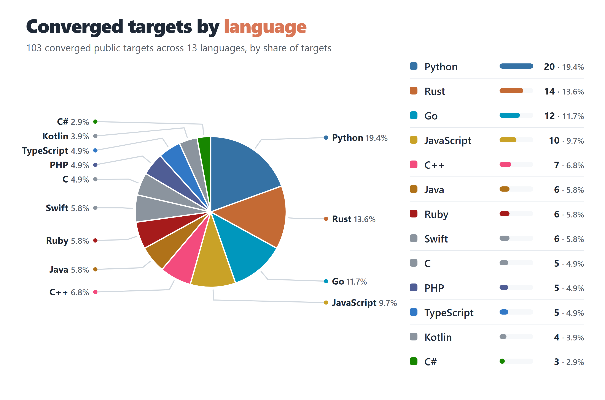
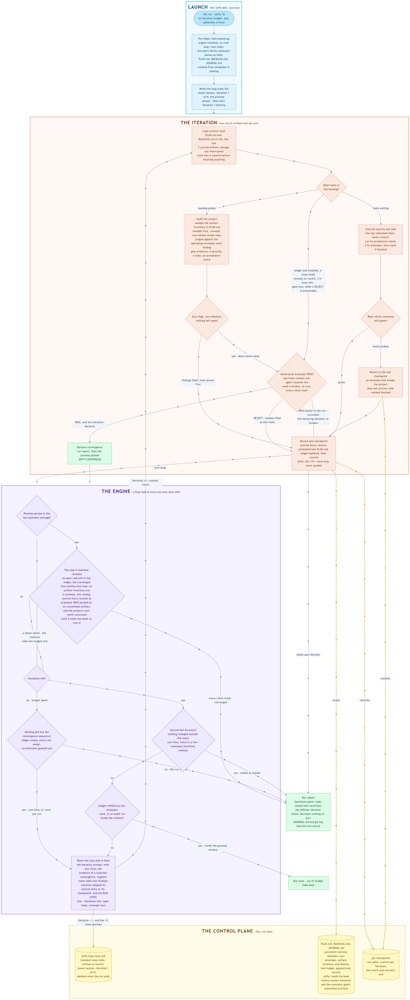

<div align="center">

<picture>
  <source media="(prefers-color-scheme: dark)" srcset="media/banner-dark.png">
  
</picture>

[](https://github.com/lenamonj/jeffy-loop/actions/workflows/validate.yml)
[](https://claude.com/claude-code)

[](https://claude.ai)
[](LICENSE)

**[Quickstart](#quickstart)** &nbsp;·&nbsp; **[Usage](#usage)** &nbsp;·&nbsp; **[Why Jeffy](#why-jeffy)** &nbsp;·&nbsp; **[The receipts](#external-validation-public-open-source-projects)** &nbsp;·&nbsp; **[How a run works](#how-a-run-works)** &nbsp;·&nbsp; **[The rules](#the-rules-a-run-lives-by)** &nbsp;·&nbsp; **[White paper](https://github.com/lenamonj/jeffy-loop/raw/main/The-Jeffy-Loop.pdf)**

</div>

Jeffy Loop is an autonomous improvement loop for [Claude Code](https://claude.com/claude-code) that works on your codebase the way a disciplined principal engineer would: audit first, fix one verified task at a time, prove every claim, and stop when the job is actually done.

Run `/jeffy 10` and walk away. Jeffy maps your project's whole public surface, audits it breadth-first, and writes a backlog where every task carries a runnable acceptance check. Then it executes: one verified, checkpointed task per iteration, behind a verify gate that reverts anything that breaks your project. And "done" is never a feeling - a fresh audit must come back clean, an adversarial evaluator must countersign, and a plain shell script re-checks the whole claim before the run is allowed to end.

It has receipts. Widely used open-source libraries have been run to convergence, surfacing shipped, reproducible bugs - many hiding behind green test suites - and three greenfield builds converged from empty directories under external judges the loop could not edit, one of them against a deliberately mutated specification. [The receipts are below.](#external-validation-public-open-source-projects)

New to autonomous agent loops, or want the full argument? **The Jeffy Loop** is a 33-page white paper written for readers with no prior knowledge of agents: how loops got here from ReAct to AutoGPT to the Ralph Loop, what Anthropic recommends and what that guidance leaves open, then every rule below explained from first principles - including an honest account of what this method still cannot do. It cites 28 sources, all linked. **[Download it here.](https://github.com/lenamonj/jeffy-loop/raw/main/The-Jeffy-Loop.pdf)**

<div align="center">


<sub>The head-to-head vs a raw prompt loop. Every row is a guarantee you can verify in the code: the engine is <code>skills/jeffy/hooks/stop-hook.sh</code>, the discipline is <code>skills/jeffy/references/iteration-prompt.txt</code>, and the receipts live under <a href="evals/"><code>evals/</code></a>.</sub>

</div>

Jeffy Loop descends from Geoffrey Huntley's [Ralph technique](https://ghuntley.com/ralph/) - the insight that a coding agent re-fed one prompt in a loop compounds into real work. The head-to-head above is engine versus method: the raw loop is the engine pattern Jeffy is built on, and Jeffy is the engineering method wrapped around it. The method distills what the people running loops at scale have published - Anthropic's [Claude Code best practices](https://code.claude.com/docs/en/best-practices) and [Boris Cherny's public workflow](https://x.com/bcherny/status/2007179832300581177): give the agent a check it can run, one task at a time, promote every hard-won lesson into a file the next run reads, and prefer small fresh-context runs over one long one.

## Quickstart

You need exactly two things. The installer handles everything else, including `jq`.

1. **[Claude Code](https://claude.com/claude-code)** - installed and signed in once
2. **[git](https://git-scm.com/downloads)** - confirm with `git --version`

No git yet? One command for your platform:

**Windows**

```powershell
winget install Git.Git
```

**macOS**

```bash
brew install git
```

**Debian/Ubuntu**

```bash
sudo apt-get install git
```

Install Jeffy:

```bash
git clone https://github.com/lenamonj/jeffy-loop.git
cd jeffy-loop
./install.sh        # Windows PowerShell: .\install.ps1
```

> [!NOTE]
> If PowerShell blocks the installer with "running scripts is disabled on this system", run it once with `powershell -ExecutionPolicy Bypass -File .\install.ps1` - the bypass applies to that single invocation only.

The installer verifies the Claude Code CLI and `jq` (offering to install it via winget, Homebrew, or apt), copies the `/jeffy` and `/cancel-jeffy` skills - engine included - to `~/.claude/skills`, and registers the loop's hook in `~/.claude/settings.json`. Every step prints an [OK] or the exact fix.

- **Re-run** - always safe: it skips what is installed, upgrades in place, and never duplicates the hook registration.
- **Update** - see [Already installed? Upgrade](#already-installed-upgrade) below.
- **Uninstall** - delete `~/.claude/skills/jeffy` and `~/.claude/skills/cancel-jeffy`, and remove the hook entry from `~/.claude/settings.json`.

Then open Claude Code in the project you want to improve and type `/jeffy 10`.

> [!TIP]
> `/jeffy` is a slash command inside the Claude Code session, not a shell command.

When that run ends, close the session and start a new one to run it again. That restart is doing real work, and [why is worth two minutes](#use-several-short-runs-not-one-long-one).

### Already installed? Upgrade

Upgrading touches `~/.claude` and nothing else. No project you have run against is modified. Pull and re-install:

```bash
cd jeffy-loop && git pull
./install.sh        # Windows PowerShell: .\install.ps1
```

Then **start a new Claude Code session** - skills and hook registrations are read at session start, so an open session keeps running the old engine until you restart it. That is the whole upgrade. `/jeffy` names the engine version on its first line, so you will see the new one immediately.

Deleted the clone since installing? Clone it again and run the installer from there; it only ever reads from the clone.

> [!NOTE]
> Do not upgrade underneath a live run. The Stop hook is read from disk every time it fires, so replacing it mid-run changes that run's rules halfway through. Let the run finish, or stop it with `/cancel-jeffy` first.

> [!NOTE]
> The installer copies over the top and never deletes, so a file removed in a later version stays behind. For a clean slate, delete `~/.claude/skills/jeffy` and `~/.claude/skills/cancel-jeffy` before re-running it - the installer puts both back.

## Usage

```
/jeffy [N] [focus...]
```

- `N` - iteration budget, default 10. Sizing is low-stakes in both directions: the loop ends itself at convergence, so unused budget costs nothing, and a budget that runs dry loses no work - the next `/jeffy` picks up where the run stopped. The floor for converging in one run is the opening audit, one iteration per expected finding, and a closing audit; when that arithmetic outgrows the default, prefer a second run over a bigger number (see [Good to know](#good-to-know)).
- `focus` - optional directive for the run, e.g. `/jeffy 8 test coverage and error handling`.

```
/jeffy                                     # 10 iterations, full-spectrum improvement
/jeffy 5                                   # 5 iterations
/jeffy 12 accessibility and performance    # 12 iterations with a focus directive
```

> [!NOTE]
> Enhance mode (`/jeffy [N] enhance <topic>`, shipped in v1.6.0) was removed in v1.11.0: it was a second product surface no published receipt ever used, and the defect loop is the product. The launcher refuses the keyword, and it refuses a standard launch over an Enhance-mode `PLAN.md` left behind by an earlier version - archive those state files (commit and delete them, or keep them on a branch) and relaunch, or run v1.10.0, the last release that carries the mode.

**Scoped mode.** By default `/jeffy` runs in Improvement mode: an open-ended audit-and-fix loop. To run it against a concrete target instead, edit `PLAN.md` - replace the Goal and Definition of done with the target, seed `BACKLOG.md` with the finite tasks, then run `/jeffy`. Everything else (envelope, verify gate, checkpoints, journal, report) behaves the same.

**Cancel.** Run `/cancel-jeffy`. It reports which loop it found, deletes the loop state file, and leaves `PLAN.md`, `BACKLOG.md`, and `JOURNAL.md` untouched, so the next `/jeffy` picks up exactly where it left off. (Equivalent manual action: delete `.claude/jeffy-loop.local.md` at the project root.)

## Good to know

- **One loop per project at a time.** A crashed session can leave a stale state file behind; the skill detects it at launch and asks before cleaning up.
- **You can talk to the session mid-run.** Your message gets answered, then the loop resumes on its own. The turn counts against the budget.
- **Permission prompts pause the loop.** For unattended runs, allowlist your test and file tools or use acceptEdits mode. Never allowlist push or force operations for a loop.
- **Budget counts turns, and a single turn is unbounded in time and cost.** Keep N small on a first run and watch it. Check spend anytime with `/cost`.
- **Prefer several small runs over one big one.** Context accumulates across iterations within a run, and the state files carry everything between runs, so two runs of 5 beat one run of 10 - but the clean context only arrives with a new session. Close the session and start a fresh one in the same directory; nothing is lost.
- **Edit `PLAN.md` or `BACKLOG.md` between iterations, not mid-iteration.** The Proposed section is the designed channel for decisions.
- **A `.jeffy/` directory appears at the root of a project the loop has swept.** It holds the known-answer probe batteries a later sweep re-runs instead of rebuilding, and from 1.7.0 the evaluator artifacts under `.jeffy/evaluator/` - one per gate invocation, naming the commands the adversarial gate actually ran and what they exited. The checkpoints commit all of it on purpose - loop memory, exactly like the three state files. Only the transient loop state file is gitignored.

> [!IMPORTANT]
> **Trust model.** The entire engine is one auditable shell script in this repo (`skills/jeffy/hooks/stop-hook.sh`), registered as a Claude Code Stop hook. It fires at turn end but exits instantly unless the current project has a live Jeffy state file naming that session - zero cost and zero behavior outside a run. The installer's only writes outside this repo are the two skill folders it copies into `~/.claude/skills` (engine included), that one hook registration in `~/.claude/settings.json`, and - only when jq is missing and you answer yes to its prompt - a jq install through your system package manager (winget, Homebrew, or apt).

## Why Jeffy

- **An engineer's judgment, not a linter's.** Every run starts from a real audit - architecture, correctness, security, testing, error handling, performance, accessibility, developer experience, and more - and every finding becomes a prioritized task with a concrete acceptance check. Evidence over assertion: a finding exists only if the loop can point at it.

- **It cannot wreck your repo.** Every iteration ends in a local checkpoint commit, and a repo-level verify gate reverts any iteration that breaks the project on the spot. Nothing is ever pushed and no branches are created, so you review with `git log`, revert any single iteration, and squash the run when you are happy.

- **It doesn't invent problems.** Severity is judged against a declared operating envelope - your project's real input surfaces, not imagined attackers - so out-of-envelope findings cannot inflate the backlog. Only you can widen the envelope: the loop files a proposal and moves on.

- **Done means no High, no Medium, and every Low on the record.** A declaration needs a fresh full audit finding zero High and zero Medium, with any open Low carried, named in the closing entry, and published beside the receipt rather than quietly dropped. A surface inventory bounds the claim, so "no findings" can never mean "nowhere looked".

- **Convergence needs a second signature.** An agent grading its own work praises it, so before the loop may claim anything an adversarial evaluator - a fresh-context sub-agent carrying none of the run's self-persuasion - re-runs the verify gate and every closed task's acceptance check, hunts for what was missed, and must return PASS. Each verdict is written to its own committed artifact naming every command it ran and that command's real exit status.

- **The stop is machine-checked, and the machine is tested.** The Stop hook is plain shell, not a model, and it refuses a converged stop that fails any of its conditions, re-feeding the evidence to the loop instead of letting the claim through. The engine itself is held to <!-- count:checks -->**216 behavioural checks**<!-- /count --> on each CI leg, Linux, Windows, and macOS, with a shellcheck lint pass riding the Linux leg on top.

- **It has a self-learning mechanism, and it is pointed at itself.** A rule learned the hard way binds every iteration after it, and a rule that has to be written a second time is proposed for promotion into a mechanism, on the reasoning that a rule needing to be written twice is a rule the text is not enforcing. That is not an intention: it has happened on real targets whose published journals carry the loop's own words for it, and it is how a defect met in a stranger's repository becomes this engine's next version.

- **It stops on purpose, and it shows its work.** Budget spent, convergence reached, progress stalled, or a decision only you can make - the loop ends itself and says which, instead of burning budget spinning. The run report lists iterations used, tasks closed with severities, the diffstat, anything blocked, and decisions waiting on you, over an append-only journal and checkpoint commits that hold the full greppable record.

Each of these is stated as an enforced condition in [the rules a run lives by](#the-rules-a-run-lives-by), and the mechanism behind the seventh is in [the loop improves the loop](#the-loop-improves-the-loop).

<div align="center">

<picture>
  <source media="(prefers-color-scheme: dark)" srcset="media/language-pie-dark.png">
  
</picture>

<sub>Every converged public target, by the language it was written in. Counts are derived from the receipts table below at render time by <a href="scripts/render-language-pie.py"><code>scripts/render-language-pie.py</code></a>, and the alt text above is derived from the same table by the repo validator, so neither the chart nor its description can disagree with it. Both read the slices largest first, ties alphabetical. Chart source: <a href="media/language-pie.html"><code>media/language-pie.html</code></a>.</sub>

</div>

## External Validation: Public Open-Source Projects

Testing a tool against its own codebase proves little. Jeffy was therefore run against widely-used open-source projects with no connection to this repository. <!-- count:converged -->28<!-- /count --> of those runs converged, across <!-- count:languages -->12<!-- /count --> languages - Python, JavaScript, TypeScript, Java, C#, C, C++, Go, Rust, Ruby, PHP and Swift - and that breadth is evidence of something specific rather than decoration: the engine ships no language-specific analyzer, no ruleset, and no per-ecosystem plugin. It works from what a project already has, its own test suite and its own verify command, so what carries from a Rust CLI to a Ruby linter to a C++ parser is the method itself. The findings are correspondingly varied: a security flag that did nothing when output was piped, a documented build configuration that had never compiled on MSVC, a Content-Length no parser should accept becoming a wrong number, a panel header dropped rather than truncated.

Every run used a local clone, nothing was pushed upstream without a filed issue or PR, and every run was held to the rules current at its date - a standard that tightened on every axis but one, and says so plainly: from v1.9.0 a declaration no longer waits on Low-severity findings, which are published with the receipt instead, while severity scoring itself came under the evaluator's independent re-score at the same moment. Of the <!-- count:converged -->28<!-- /count -->, **<!-- count:countersigned -->23<!-- /count --> converged under the adversarial evaluator's countersignature, <!-- count:evaluator-unavailable -->1<!-- /count --> recorded the evaluator as unavailable and says so, and <!-- count:pre-evaluator -->4<!-- /count --> predate the gate entirely**, converging under the earlier standard of a clean closing audit and an empty backlog. Each of those <!-- count:converged -->28<!-- /count --> receipts names the standard its run met. What never varied: evidence before filing, severity judged against a declared operating envelope, and red-green proof that anyone can re-run.

Each receipt below is a full `/jeffy` loop run that converged, with one deliberate exception kept in the table rather than hidden: PapaParse, an audit under the same method whose loop conversion waits on four open upstream PRs. A method that always converges is not measuring anything, and the record shows what the standard costs when a project resists it - python-dotenv was published here as *not converged* through four runs and 25 findings, and it took eight runs and 73 iterations before an audit finally filed nothing. sqlparse makes the same point under a stricter rule: its run budget of five was fixed in writing before its first iteration, four runs failed and two of those ended blocked, and it converged on the fifth and last budgeted run. Had it rejected once more it would have been published as a non-convergence, because the rule said so in advance rather than afterwards. The run before python-dotenv's converging one ended blocked, out of evaluator invocations, with three fresh Mediums on the ledger. The standard tightened as the engine matured. The earliest runs converged on a clean closing audit and an empty backlog, later runs under the shell-enforced converged stop, and the most recent under the adversarial evaluator's countersignature. Each converged receipt states which standard its run met, so none of this requires taking our word for it - PapaParse carries no such line because it is the audit, not a loop run, and its row says so.

<sub>Ordered by severity of findings, most severe first.</sub>

| Project | Stars | Language | Iters | Upstream | Headline |
|:---|---:|:---|---:|:---|:---|
| [quantstats](evals/quantstats/REPORT.md) | 7,489 | Python | 40 | [issue filed](https://github.com/ranaroussi/quantstats/issues/537) | 29 findings behind 125 green tests; the library ended smaller than it started |
| [fasthttp](evals/fasthttp/REPORT.md) | 23,422 | Go | 58 | **[FIX MERGED](https://github.com/valyala/fasthttp/pull/2343)** | 31 findings in a tagged release; a Content-Length no parser should accept became a wrong number |
| [swift-algorithms](evals/swift-algorithms/REPORT.md) | 6,323 | Swift | 24 | - | the twelfth language: one real High in Apple's code, then fourteen findings tracing back to a single cause - nothing compiled or ran the doc-comment examples, so ten of them did not compile. Run 2 refused a loophole that would have earned it a third evaluator invocation |
| [cJSON](evals/cjson/REPORT.md) | 12,916 | C | 10 | - | the eleventh language, and the first target picked by shape rather than by oracle: a pre-registered two-run budget, converged in one. Sorting an object silently dropped every later append. The gate rejected a leaking test the project's own suite could not see |
| [magic_enum](evals/magic_enum/REPORT.md) | 6,165 | C++ | 19 | - | six broken public members of a header-only library that no compiler had ever seen - C++ does not compile a class template member nothing instantiates, and nothing did. One of them answered `all() == false` on a full bitset without crashing. The structural fix makes the suite instantiate them, so a seventh cannot ship |
| [commander.js](evals/commander-js/REPORT.md) | 28,358 | JavaScript | 10 | - | the most-used CLI framework in Node, and the cleanest target in the corpus: 1,373 green tests, no High findings, and an error message naming an argument the user never typed. The gate rejected on the last iteration and the fix landed inside the one-transaction rule |
| [claude-code-action (attempt 2)](evals/claude-code-action/REPORT.md) | 8,618 | TypeScript | 30 | - | the acceptance test for the engine's own release, and the sharpest limit in the corpus: attempt 1 swept 17 of 23 rows and never once reached the gate, attempt 2 swept 28 of 28 and converged - and did not rediscover three High findings attempt 1 had filed on identical code |
| [claude-agent-sdk-python (attempt 2)](evals/claude-agent-sdk-python/REPORT.md) | 7,881 | Python | 30 | - | the same limit, proved by an instrument instead of a diff: attempt 1 swept 19 of 44 rows and never reached the gate, attempt 2 swept 31 of 31 and converged - then attempt 1's own battery, run unmodified against the converged tree, exited 1 with `create_sdk_mcp_server published an empty schema`. The run had swept that row and edited that very function |
| [path-to-regexp](evals/path-to-regexp/REPORT.md) | 8,598 | TypeScript | 27 | - | three runs and five evaluator invocations, four of them REJECTs - and not one rejection was a missed defect in the library. Every one was a defect in the run's own evidence, including a verify command whose ReDoS assertions were randomized enough to pass without searching |
| [rust-url](evals/rust-url/REPORT.md) | 1,570 | Rust | 30 | [PR open](https://github.com/servo/rust-url/pull/1147) | 20 findings, 10 High, in the URL crate under cargo and reqwest; a class was settled and withdrawn three times before it held, and the PR closes a conformance case open upstream since 2023 |
| [PHP-Parser](evals/php-parser/REPORT.md) | 17,450 | PHP | 29 | [PR open](https://github.com/nikic/PHP-Parser/pull/1162) | the tenth language; told nothing, it found its project's largest oracle by itself, then proved one of the suite's own test classes passes without executing the code it names |
| [rrule](evals/rrule/REPORT.md) | 3,738 | TypeScript | 33 | - | 23 findings, 10 High, in the RFC 5545 library behind much of the JavaScript calendar ecosystem; the reference implementation overruled one of the loop's own High findings and the loop withdrew it |
| [go-yaml](evals/go-yaml/REPORT.md) | 2,217 | Go | 29 | [PR open](https://github.com/goccy/go-yaml/pull/915) *(not a loop finding)* | 20 findings, 6 High, including a regression the run introduced and the gate caught; the vendored conformance corpus never ran, and scores identically before and after |
| [records](evals/records/REPORT.md) | 7,220 | Python | 7 | [issue filed](https://github.com/kennethreitz/records/issues/236) | four High data-loss bugs behind a green suite |
| [PyPortfolioOpt](evals/pyportfolioopt/REPORT.md) | 5,905 | Python | 58 | [PR open](https://github.com/PyPortfolio/PyPortfolioOpt/pull/751) | CI-red baseline to 356 passing; the evaluator rejected five convergence attempts |
| [dayjs](evals/dayjs/REPORT.md) | 48,657 | JavaScript | 74 | [PR open](https://github.com/iamkun/dayjs/pull/3167) | 45 findings, 10 High, in a 63M-downloads-a-week library |
| [mustache.js](evals/mustache.js/REPORT.md) | 16,725 | JavaScript | 11 | [issue filed](https://github.com/janl/mustache.js/issues/848) | revived a suite that could not start; npm audit 107 to 2 |
| [ta](evals/ta/REPORT.md) | 5,129 | Python | 64 | - | wrong numbers shipped since 2023; caught its own regression and wrote "It is mine" |
| [bat](evals/bat/REPORT.md) | 59,915 | Rust | 10 | **[FIX MERGED](https://github.com/sharkdp/bat/pull/3862)** | a just-merged security flag did nothing when piped; caught before it ever shipped |
| [jsoncpp](evals/jsoncpp/REPORT.md) | 8,876 | C++ | 10 | [PR open](https://github.com/open-source-parsers/jsoncpp/pull/1709) | the documented secure-memory build never compiled on MSVC; the evaluator caught the fix being half done |
| [yfinance](evals/yfinance/REPORT.md) | 24,837 | Python | 9 | [PR open](https://github.com/ranaroussi/yfinance/pull/2927) | closed a High that upstream's own failing test was advertising |
| [speedtest-cli](evals/speedtest-cli/REPORT.md) | 14,080 | Python | 5 | - | the restraint case: small findings, nothing invented |
| [chalk](evals/chalk/REPORT.md) | 23,288 | JavaScript | 8 | **[FIXED UPSTREAM](https://github.com/chalk/chalk/pull/687)** | the control: one Medium found - the maintainer wrote and merged the fix himself, shipped in chalk v6.0.0 |
| [Spectre.Console](evals/spectre.console/REPORT.md) | 11,567 | C# | 8 | [issue filed](https://github.com/spectreconsole/spectre.console/issues/2184) | a panel header wider than its content was dropped, not truncated - invisible to 3,618 tests |
| [gson](evals/gson/REPORT.md) | 24,229 | Java | 2 | - | the fastest run: one audit, one gate, one priced-and-declined Low, not a line changed |
| [RuboCop](evals/rubocop/REPORT.md) | 12,892 | Ruby | 7 | - | the null result: every cop department swept, the last 20 commits re-proven, zero findings, zero lines changed |
| [python-dotenv](evals/python-dotenv/REPORT.md) | 8,830 | Python | 73 | [PR open](https://github.com/theskumar/python-dotenv/pull/678) | the grind: 8 runs, 48 findings, seven audits that each filed something before the eighth came back empty; suite 220 to 511 |
| [sqlparse](evals/sqlparse/REPORT.md) | 4,009 | Python | 47 | - | the pre-registered budget was five runs and it took five; the loop declined a finding the gate handed it, after running the claim |
| [PapaParse](evals/papaparse/REPORT.md) | 13,532 | JavaScript | *audit* | [4 PRs open](https://github.com/mholt/PapaParse/issues/1132) | four Highs in the streaming path; conversion waits on four open PRs |

Disclosure is deliberate and selective. Filing a machine-generated issue costs a maintainer real attention, so these findings go upstream only where the defect is severe and the project takes outside contributions; where nothing was filed, the receipt says so and why.

**What is not in the table above is in [evals/ATTEMPTS.md](evals/ATTEMPTS.md):** every target ever started, the runs each one cost, which of three convergence standards it met, and the one public target that was abandoned without a receipt. Convergence here is per-run and a blocked run gets relaunched, so run counts are published with the wins attached rather than a bare success rate. Targets from here on carry a pre-registered run budget committed before their first iteration.

### Greenfield: three builds judged by suites the loop did not write

Every receipt above is brownfield - the project arrived with a test suite the loop did not author. The white paper's own limits section names the residual weakness anyway: the loop writes many of the tests that certify the loop. Greenfield is that weakness at its maximum, so the answer was pre-registered: start from an empty directory, commit the goal and a Verify command naming an **external judge** before iteration 1, ship the backlog empty so the task decomposition is the loop's own work, and never intervene in a run. The engine is unmodified. All three targets converged.

| Target | Judge | Final position | Rows swept | Iterations | Runs |
|:---|:---|:---|---:|---:|---:|
| [TOML 1.0 decoder, Rust](https://github.com/lenamonj/jeffy-greenfield-toml) | `toml-test` v2.2.0 - 679 external assertions | **205 of 205 valid, 474 of 474 invalid** | 17 of 17 | 11 | 1 |
| [gitignore matcher, Rust](https://github.com/lenamonj/jeffy-greenfield-gitignore) | `git check-ignore` 2.50.1, differential | **106 cases, 300 queries, 0 disagreements** | 12 of 12 | 42 | 5 |
| [TOML-M decoder, Rust](https://github.com/lenamonj/jeffy-greenfield-toml-mutated) - *mutated spec* | `toml-test` v2.2.0 through a frozen output adapter | **205 of 205 valid, 474 of 474 invalid** (and 169 of 205 against *standard* TOML) | 17 of 17 | 14 | 1 |

The TOML decoder's zero measurement was the suite failing because the binary did not exist; eleven iterations later every one of 679 externally authored assertions passed, and even the surface-inventory rows were the suite's own test groups rather than the loop's choice. The gitignore matcher is the stopping-discipline story: its frozen corpus was fully green from the first iteration of run 2, and everything after that was the adversarial evaluator probing beyond the corpus and refusing to countersign - **invoked 8 times, rejecting 7**, filing findings that marched from matcher semantics into `wildmatch.c`'s escaped-slash clause, git's four-byte `isspace`, NTFS case folding, 8.3 short-name aliases, and the Win32 normalization layer git's own file opens bypass. Three runs ended blocked and are published as the receipts they are; once, the loop reproduced two of its gate's three rejection reasons and **refuted the third with direct oracle evidence**, filing exactly what reproduced.

The third target answers the objection the first two invite: TOML and gitignore saturate any plausible training set, so convergence there might measure recall. **TOML-M is TOML v1.0.0 with two rules deliberately inverted** - `true` and `false` swap payloads, and tab and line feed swap inside string values - so remembering the real format produces wrong answers. Both amendments are involutions, which lets the unmodified `toml-test` binary stay the judge through a frozen 61-line adapter that inverts the decoder's output. The receipt reports two numbers from one binary: **205 of 205 against the mutated suite, and 169 of 205 against standard TOML**, failing on exactly the cases the mutation touches. It built the dialect rather than recalling the format, at a cost of 14 iterations against 11 for the unmutated build. That receipt also discloses a rule violation on its own front page: an audit ran inside the closing extension window, which the engine forbids, and the convergence declaration cites it.

Stated as narrowly as the result deserves: the same engine, unmodified, converged on builds whose completeness was decided by judges it did not write - including one where recalling the real specification actively hurts. Not claimed: any completion rate (three chosen targets are not a sample), or invention (a two-rule dialect is not a novel format). The gitignore corpus is self-authored - frozen at 53 cases, grown monotonically to 106, never shrunk, and since scored cold against 119 blind-authored queries with no disagreements - and the white paper weighs that honestly against the TOML target's fully external 679. All three repositories ship their complete run record - pre-registration, journal, backlog, every iteration commit - because for a greenfield build the process is the evidence.

## How a run works

<div align="center">

<picture>
  <source media="(prefers-color-scheme: dark)" srcset="media/flowchart-dark.png">
  
</picture>

<sub>How one command becomes a run. Solid arrows are control flow; dashed arrows are the file reads and writes that steer it. Outside a run the Stop hook exits instantly - no live state file, no behavior - and <code>/cancel-jeffy</code> ends a run at any time. Diagram source: <a href="media/flowchart.mmd"><code>media/flowchart.mmd</code></a>.</sub>

</div>

Running `/jeffy` in a Claude Code session:

1. **Bootstraps the loop's memory** at the project root: `PLAN.md` (goal, operating envelope, surface inventory, verify command, lessons, definition of done), `BACKLOG.md` (the task ledger - findings prioritized most severe first, plus proposals awaiting your decision, settled defect classes, and the Converged record), and `JOURNAL.md` (append-only iteration log). They persist between runs.
2. **Runs the budgeted loop.** The first audit fills the surface inventory and the backlog. Each iteration after that either audits or executes exactly one task, verifies it, and checkpoints it; a task that newly breaks the verify command is reverted. Once one full audit comes back clean of High and Medium, the run stops auditing and finishes the ledger.
3. **Stops for a reason and reports.** Convergence - a clean audit, an empty ledger, a fully swept inventory, the adversarial evaluator's PASS, all re-checked in shell by the Stop hook - or the budget, a stall, a hard blocker, or your cancel. The run report lists tasks closed with severities, the diffstat, rows swept of rows total, and anything waiting on your decision.

### Use several short runs, not one long one

A budget is a ceiling, not a target, and the practice that produced every receipt here is the same one worth copying: **run `/jeffy 10`, let it finish, close the session, then open a new one and run `/jeffy 10` again.** The receipts that took 40 or 58 or 74 iterations got there as four to eight budgeted runs, never as one enormous budget.

That is not superstition about round numbers. The loop is built to start each iteration from written state - `PLAN.md`, `BACKLOG.md` and the last few journal entries - precisely because a fresh reading of the record is more reliable than a long conversation's memory of it. Inside a single session, though, that conversation keeps growing: every audit, every diff, every command output stays in context, and the loop ends up reasoning over its own accumulated transcript instead of the files it was designed to reason over. A new session throws that away and forces it to re-read what it actually wrote. The receipts bear the cost of skipping this out: in the python-dotenv run, later runs kept filing Highs and Mediums on surface that earlier runs had already swept and scored clean.

The restart also gives you the natural review point. Between runs the tree is committed, the report is written, and the handoff names what comes next, so it costs nothing to read the journal, answer anything filed under Proposed, and decide whether to keep going. And because every journal entry is stamped with the run that produced it, a bug introduced in run 3 stays attributable to run 3 rather than dissolving into one undifferentiated log.

Nothing breaks if you hand it a bigger budget. The state files persist, the ratchet skips a re-audit on an unchanged tree, and a fresh run picks up exactly where the last one stopped. Short runs are simply how you get the loop's design working for you instead of against it.

Jeffy built this repository by running on itself, and that convergence is re-earned, not archived - every fresh run has to reach it again with fresh evidence. It last did on 2026-07-31, the day after v1.5.0 shipped, running Fable 5 at x-high effort: the opening audit filed three Mediums against the repo's own trust-model and check-count claims, one iteration each fixed them, and the stop still had to be earned. The dev journal stays out of the published tree, since state files are the loop's memory rather than the product, but the closing sequence, abridged, shows the texture of a converged stop:

```
## iter 5/8 | e64f9b2c-160059 | 2026-07-31 | AUDIT | audit

Verification: bash scripts/validate.sh exit 0 fresh this iteration,
119 OK, 0 FAIL, 96s wall against the hook's 240s verify budget.
Inventory: all 12 rows stand. Dimension scores over all 12 swept rows,
fresh evidence each: (12 dimension scores, every one None)
Result: zero High, zero Medium, zero new findings at any severity.
Closeout begins: no further audit or replenishment this run; only the
convergence sequence remains.

## iter 6/8 | e64f9b2c-160059 | 2026-07-31 | EVALUATOR | converged

Verification: Evaluator: PASS - fresh-context adversarial review
confirmed scope, re-ran the Verify command at exit 0 (119 OK, 0 FAIL,
1 SKIP), (re-proved each of the run's three findings against the
shipped files) and found no missed in-envelope High or Medium.
Closing conditions: closing audit scored zero High zero Medium over
all 12 swept rows; Now, Next, Later all empty; all three filed
findings completed (D1 at 5e9be82, D2 at 71a420c, D3 at fa73cf3);
no unswept or stale inventory row; Converged line appended for
fa73cf3a6e5e277d80e48dc2d34111f67cc4f526.

(run report, and then the session's last words - the phrase the
Stop hook verifies against every condition above before letting
the run end:)

<promise>JEFFY CONVERGED</promise>
```

When Jeffy converges on your project, the checkpoint lands in your `git log` and under `## Converged` in the loop's backlog, so relaunches on an unchanged tree re-verify instead of re-auditing. Run `/jeffy` on your own project and read the journal it leaves behind.

## The rules a run lives by

Each rule is enforced by the iteration prompt, the state files, or the Stop hook itself - not by good intentions.

**Every iteration**

- **One verified task per iteration.** Every task carries a runnable acceptance check; done means the check ran and passed. Three failed fix attempts mark the task blocked with a reason instead of thrashing.
- **Checkpoint everything, push nothing.** Every iteration ends in a local commit prefixed `jeffy:` - the revert and recovery unit. No pushes, no branches; pre-flight warns on a dirty tree so your work is never swept into a checkpoint. Without git, checkpoints degrade to journal-only discipline.
- **The verify gate guards every change.** An iteration that newly breaks the verify command recorded in `PLAN.md` is reverted on the spot and its task marked blocked.
- **Interrupted work is salvaged, never discarded.** A run that resumes over a dirty tree commits the salvage before touching anything.
- **Every iteration answers for its hygiene.** Between iterations the hook checks the journal entry (heading grammar, with a run token telling two runs in one session apart), the checkpoint, and that `JOURNAL-archive.md` only ever grows. Violations ride the next re-feed as an ITERATION HYGIENE note.
- **Stalls end runs before budgets do.** Progress means a path outside the loop's own memory moved, or that `BACKLOG.md` changed. The loop's own memory is `PLAN.md`, `BACKLOG.md`, `JOURNAL.md`, `JOURNAL-archive.md`, `.jeffy/`, and the two files under `.claude/` the loop and the harness write for themselves. A checkpoint commit is not progress on its own, which is the point: the engine commits every iteration, so a gate that watched HEAD would only ever watch itself. The first flat iteration re-feeds with a STALL note, and a second consecutive one ends the run from shell. The convergence sequence is exempt, because a closeout audit, the evaluator gate, a ratchet and a wrapup legitimately touch state files only. That exemption is capped at three consecutive iterations, the length of the sequence itself, because the entry type claiming it is eleven characters the run writes about itself. Without git, the ledger signal alone decides.
- **The hook does the budget arithmetic.** Every re-feed carries a RUN STATE line the engine counts itself: the iteration and how many remain after it, open tasks per section, and unswept rows. Once the ledger is empty over a swept surface it also adds what the convergence sequence still costs, so a run plans its endgame instead of discovering it at the last iteration.

**Every audit**

- **Audits work from a written map, never from wandering.** The first audit lists the whole public surface as a checkbox inventory in `PLAN.md` and probes it breadth-first before filing anything. Every sweep records the commit it certified, a row reopens when its code changes, dimension scores claim only swept rows, and no run converges while a row is unswept.
- **Sweeps prove correctness, not liveness.** A row that computes values needs a known answer or a strong invariant - run-without-crashing certifies nothing - and every documented parameter must be shown to change the output at two or more values. A parameter whose value changes nothing is a finding, never a pass.
- **Instruments are kept, not rebuilt.** A row's known-answer battery lives under `.jeffy/probes/` and the checkpoints commit it, so a re-sweep re-runs the battery instead of reconstructing it, and a battery is updated in the same iteration as the behavior it pins.
- **Every finding is classed by the files its fix will touch.** Backlog lines are written `- [ ] ID (Severity, class, dimension): finding. Acceptance: check.` with a class of runtime, test, build-ci, docs, or dev-tooling, and a section is ordered by severity first, then runtime ahead of the rest, because shipped behavior is what a user meets and perimeter work is what a run drifts into.
- **Severity comes from the envelope, never from imagination.** Envelope changes and audit escalations go to the Proposed section of `BACKLOG.md` for your approval - the loop never widens its own mandate.
- **Changes are made with the map open.** Before touching shared code the loop reads its callers and the tests that pin it and states the contract the change preserves; a change that alters behavior updates the documentation and reopens the affected inventory rows in the same iteration.
- **The third strike forces structure.** Repeated-idiom fixes must enumerate and cover every sibling site; the third finding sharing one root cause forces a single structural fix or a user decision, never a fourth spot patch.

**Convergence**

- **Convergence is sticky.** The converged commit is recorded; relaunching on an unchanged tree re-verifies and re-converges in O(1) instead of re-rolling the audit dice. A seeded backlog or a focus directive always gets a real run, and settled defect classes are never re-litigated on unchanged code.
- **Convergence needs the adversarial evaluator's signature.** One fresh-context sub-agent that assumes the work is broken re-runs the checks itself, bound by the same envelope and evidence rules. It runs the iteration the ledger first empties, given a clean full audit on the record and three or more iterations left, so that a rejection can still be answered.

  The cap is absolute and cannot be worn down by persistence: at most two reviews per run, or three when the first landed before the budget's midpoint. What ends a run is a rejection with no review left, not the second one as such. A terminal rejection spends the rest of the budget closing the findings the gate filed and ends blocked, deferring the declaration to the next run's fresh gate rather than forfeiting iterations already paid for. A session that cannot spawn sub-agents records the reason and ends blocked, because the gate is never skipped and never waived. The ratchet never invokes it.
- **The converged stop is enforced in shell.** At the promise, the Stop hook re-checks every condition itself, and all of them must hold:

  - a ledger that exists with zero open High and zero open Medium - an open Low is carried and named, and a task line with no parseable severity blocks, because the floor fails closed;
  - a Converged line whose commit is reachable from HEAD and still certifies the tree;
  - no unswept inventory row;
  - a verify command that has declared its oracle class and the targets this platform excludes;
  - an evaluator PASS in the run's closing journal entry, backed by the gate's committed artifact at its highest invocation ordinal;
  - the project's own verify command exiting 0 when the hook re-runs it.

  That re-run is bounded by a timeout whose bound resolves as `verify_timeout_seconds`, else `Verify duration` x3 floored at 240s, else 240s, so a suite that legitimately runs long is bounded by its own measured time rather than refused for outrunning a bound nobody measured. The bound is enforced by `timeout`, `gtimeout`, or a shell watchdog, so it holds on a host with no GNU coreutils.

  Violations block the stop and re-feed the evidence. A violation landing once the budget is spent buys one corrective re-feed, telling the run to record the refusal and close without claiming convergence, rather than the refusal going only to stderr where nobody reads it. One bound is worth stating because the engine does not deliver more: where a closing-extension gate has already ended the run for its own stated reason, that gate wins and the refusal is not re-fed. Genuinely missing infrastructure - no `PLAN.md`, no `Surface inventory` section - fails open with a stderr diagnostic; a missing ledger or journal does not, because every gate reads them.

**Always**

- **Published code is run code.** Anything that leaves the project - an issue body, a report, a pull request - must have been executed in exactly the form it is published. A trimmed version of a verified script is new, unverified code.
- **Lessons persist.** An operational rule learned the hard way - a build quirk, a command that must not be used - is promoted to the Lessons section of `PLAN.md`, which every future iteration reads in full. Add your own lines there to steer future runs: fix the loop, not the run.

## The loop improves the loop

The rule above - fix the loop, not the run - applies to Jeffy itself, and that is the part designed to compound. Most tools improve when their authors read bug reports. Jeffy improves by being run against its own source under its own rules, and by converting what that finds into machinery that cannot be forgotten. Four mechanisms do the work, and each leaves evidence in this repository you can check rather than take on trust.

**The engine is audited by the engine, and the results are merged in public, failures included.** Jeffy is pointed at its own repository exactly as it is pointed at any external target: same envelope, same evidence rules, same adversarial gate, no privileged mode. Those runs are in this history under their own merge commits, and the subjects say what happened rather than what would read better. `ba032bc` merged the first self-run to converge under the gate, and shipped the first published evaluator artifacts with it. `20ab642` merged the v1.9.0 self-run, converged in 6 of 15 iterations. `d89c0ac` reads, in full, *"merge: three self-runs of harness work, none of which converged"*. Real fixes came out of that third merge and none of them earned a convergence stamp, so the commit says so. A tool that publishes only its successful self-audits is evidence of nothing.

**A lesson a machine can check becomes a check, never a paragraph.** This is the mechanism that accumulates. When a run finds a defect in the engine, the fix is not a warning in the documentation but a behavioural check in `scripts/validate.sh` that fails if the defect returns. The count is the visible result: 119 checks on 2026-08-03, and <!-- count:checks -->**216 behavioural checks**<!-- /count --> on a clone twelve days later, each one added because something went wrong once and was made unable to go wrong silently again. The number in that sentence is itself derived by the validator rather than typed, which is the next mechanism.

Check K is the clearest example, because it closed the hole it was born from. The lesson was that a published number must be recomputed from the run rather than copied from wherever it last appeared. Prose saying so would have been read and forgotten. Instead check K derives the check count this README publishes from the validator run itself and refuses a mismatch - and during the v1.9.0 release build it did exactly that, rejecting a stale `203` that a human had already read past. Its own comment records that an earlier version of it overclaimed, calling that figure "the last hand-typed claim in the file" while the pie's alt text sat beside it underived. The correction is in the source, not buried in a changelog.

**The gate grades the run's evidence, not only the code.** The adversarial evaluator is the mechanism that makes self-improvement honest, because the most common failure is not a missed bug but a proof that does not prove anything. `path-to-regexp` is the plainest case in the corpus: three runs, five evaluator invocations, four of them rejections, and **not one rejection was a missed defect in the library**. Every one was a defect in the run's own evidence, including a verify command whose randomised assertions could report safe without ever searching. Those findings improve the method, not the target.

**Failures are published beside successes.** `evals/ATTEMPTS.md` carries every attempt, including **11 runs that did not converge**, each with the budget it was given before it started and the reason it ran out. A corpus of only successes cannot teach anything about where the method stops working, and knowing where it stops is what tells us what to build next. Several of the engine's largest changes exist because a published failure named the gap first.

The governing principle came from a self-run that caught its own author. A run promoted a lesson into `PLAN.md` and then broke that same lesson two iterations later, in the very work that promoted it. **A promoted lesson does not protect the iteration that promotes it.** So where a lesson can be checked mechanically it belongs in the harness, and where it cannot it is written down knowing that prose is the weaker instrument.

## Contributing

Before submitting a change, run the repo validator:

```bash
bash scripts/validate.sh
```

It gates, among other things:

- **Syntax and lint** - both installers and the Stop hook (`bash -n`, PowerShell parser, shellcheck).
- **Skill integrity** - frontmatter, referenced paths, the governance markers that keep the envelope, ratchet, verify gate, run report, and convergence rules from silently regressing - including the `Command:` line the default plan hands the hook to run - and the iteration prompt's injection invariants.
- **Behavior, not just parsing** - both installers and the Stop hook are exercised end to end, every gate proven able to fail. The full scenario list is below.

<details>
<summary>The full behavioural scenario list</summary>
<br>

Both installers run non-interactively against sandboxed profiles (skills and engine must land, and the hook registration must appear exactly once even after a re-run and carry the 600s timeout, whether written fresh or upgraded from an older entry), and the Stop hook itself is exercised through its full lifecycle: mid-budget re-feed, budget exhaustion, completion promise, foreign-session isolation, and the no-state no-op. The gates that guard the converged stop are held to the same standard - an open task, a `Converged` line that no longer certifies the tree, an unswept Surface inventory row, and a verify command that is red, that overruns its timeout, or that is declared `none` each have to produce the right outcome, a fully swept inventory and a pre-inventory `PLAN.md` are both accepted, and the verify parser is proven on the one shape the hook executes, the labelled `Command:` line - backticks stripped only when the wrapping pair is unambiguous, an annotated line named as a `bash -n` defect before anything runs, and a section carrying no command skipped with a note rather than run as prose - as are the per-iteration hygiene gates and the fail-open paths for a missing ledger, journal, or plan, a malformed counter, and a moved prompt file. The two newest gates get the same treatment: the closing extension has to be granted once at exact budget exhaustion with zero open High and zero open Medium - carried Lows included - over a swept inventory and refused everywhere else - a Medium still open, a task line whose severity the parse cannot read, a row still unswept, a flag already set, a frontmatter that never closes, an iteration already past its budget - and the granted window has to survive the Lows it was granted over while a non-evaluator refill, a Medium or a Low filed inside it, still ends the run - and a declaration must be rejected when its closing entry records no evaluator verdict, accepted on `Evaluator: PASS` backed by this run's committed evaluator artifact, rejected when that artifact is missing, belongs to another run, or sits uncommitted in the tree, rejected outright on `Evaluator: unavailable`, exempt for a ratchet, and failed open when the journal holds no entry for the run. The hygiene gates are proven both ways too: a journal heading that names the session but not the run is rejected and a legacy state file without a run token falls back cleanly, and a rotation that shrinks or deletes `JOURNAL-archive.md` is caught while an appending one passes and a never-rotated project is left alone. The stall gate is proven the same way, and from 1.7.0 against the engine's own commit behaviour rather than against synthetic state: progress on either signal stays silent, the first flat iteration draws the STALL note and arms the flag, the second consecutive one ends the run, progress resets the strike, a non-git project stalls out on the ledger signal alone, a project with neither signal skips with a stderr note, and neither budget exhaustion nor a valid promise is disturbed by an armed flag. The commit-driven cases are the ones that matter, because the loop checkpoints every iteration: two journal-only iterations that each committed draw the note and then end the run, a battery-only iteration under `.jeffy/` draws it too, a committed `.claude/settings.local.json` and a tracked loop state file are read as harness churn rather than progress, a one-line source change committed alongside the state files stays silent, all four ceremony types are exempt and carry the flag through untouched while a fourth consecutive one draws the note and a fifth ends the run, a stale entry heading at a desynced index does not exempt the entry that replaced it, a state file with no run token gets no exemption at all, a recorded head this repository cannot resolve fails open, a repository that disappears mid-run falls back to the ledger, and a forfeited closing extension is named on the way out. Both tree gates are also proven in a project that sits below the repository root, where git reports paths from the repository root and every filename the two exclusion lists carry is anchored at the project root.

</details>

Core checks need only bash and coreutils; shellcheck, PowerShell, and jq passes skip cleanly when absent, and the closing line reports how many checks ran against how many were skipped, reprinting each skip with its reason - a check that did not run covers nothing, and an exit code alone cannot say which is which. The one exception is shellcheck in the maintainer tree, where a release is cut: there it is a failure rather than a skip, because that lint rides the Linux CI leg and a skip would put its first real run after the push. CI runs the same validator on Linux, Windows, and macOS - the macOS leg exists because BSD userland differs from GNU in `sed`, `grep`, and `stat`, and nothing exercised it before.

## License

MIT
