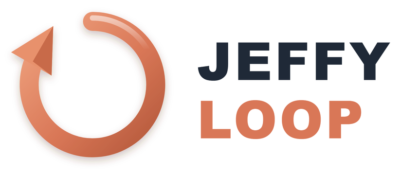
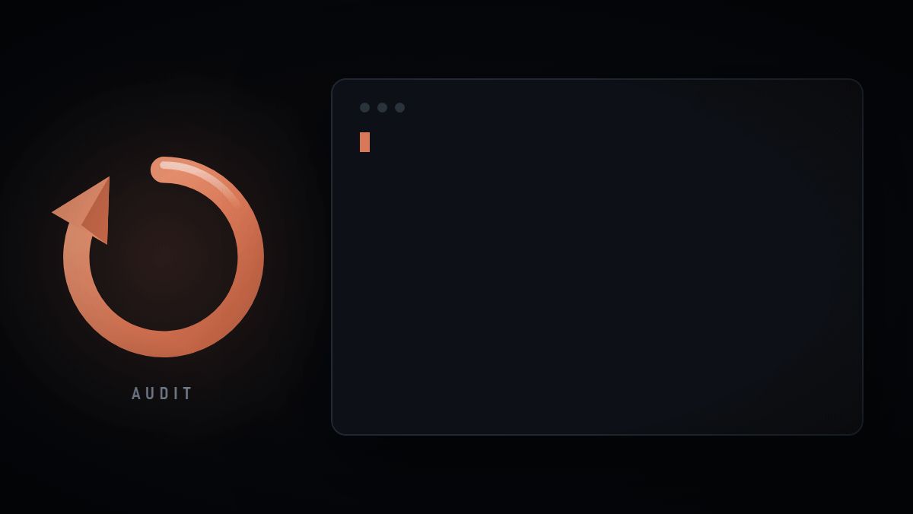

<div align="center">

<picture>
  <source media="(prefers-color-scheme: dark)" srcset="media/wordmark-dark.png">
  
</picture>

[](https://github.com/lenamonj/jeffy-loop/actions/workflows/validate.yml)
[](https://claude.com/claude-code)

[](LICENSE)

**[Quick Install](#quick-install)** &nbsp;·&nbsp; **[Usage](docs/usage.md)** &nbsp;·&nbsp; **[How it works](docs/how-it-works.md)** &nbsp;·&nbsp; **[The receipts](evals/README.md)** &nbsp;·&nbsp; **[Headless](docs/headless.md)** &nbsp;·&nbsp; **[White paper](https://github.com/lenamonj/jeffy-loop/raw/main/The-Jeffy-Loop.pdf)**

## A Claude Code loop that fixes bugs in your repo, each fix backed by a check that ran and passed. Maintainers have merged <!-- count:merged -->57<!-- /count --> of its patches.

</div>

Jeffy Loop is a Claude Code skill. Type `/jeffy` and it audits your codebase, then fixes what it finds, one task per iteration. Each fix lands as a local commit with an acceptance check that ran and passed.

If a fix breaks your tests, it is undone. Nothing is ever pushed. A standard run calls itself done only when a fresh audit is clean, a second AI reviewer that took no part in the run signs off, and your tests pass again. The harder test is whether a stranger will merge the patch.

Maintainers with no stake in this project have merged its patches, each filed as a pull request from a local clone, in <!-- count:merged-projects -->45<!-- /count --> projects, including ones run by NVIDIA, Meta, Tesla, Google, Apple, Microsoft, Netflix, Apache, Oracle, IBM, Cisco, Square, Cloudflare, and more. [See them all.](#independent-validation)

<div align="center">



</div>

## The record

Jeffy was run against <!-- count:tested -->132<!-- /count --> open-source projects with no connection to this repository, each judged by its own test suite. Every run is published, failures included.

| Projects tested | Converged | Failed | PRs merged | PRs open | Issues filed |
|:---:|:---:|:---:|:---:|:---:|:---:|
| **<!-- count:tested -->132<!-- /count -->** | **<!-- count:converged -->103<!-- /count -->** | **<!-- count:failed -->28<!-- /count -->** | **<!-- count:merged -->57<!-- /count -->** | **<!-- count:prs-open -->27<!-- /count -->** | **<!-- count:issues -->4<!-- /count -->** |

**Converged:** the closing audit came back clean and the loop's adversarial evaluator, a fresh-context sub-agent, countersigned it, a standard this repository set and checks itself. That happened in <!-- count:converged -->103<!-- /count --> projects across <!-- count:languages -->13<!-- /count --> languages with no language-specific analyzer. **Failed:** the run spent the budget declared before it started without converging, or, for libuv, was abandoned before it had one. That leaves PapaParse, an audit held to the same method rather than a loop run, which the receipts page counts as Fixed alongside the 103.

**[See every project, every patch, and every failure](evals/README.md)**

## Quick Install

You need [Claude Code](https://claude.com/claude-code), signed in once, and [git](https://git-scm.com/downloads). Each installer checks for everything else and asks before installing `jq`.

### Install Jeffy with pip

**Step 1.** Install the package.

```bash
pip install jeffy-loop
```

**Step 2.** Install Jeffy as a Claude Code skill.

```bash
jeffy install
```

---

### Install Jeffy with uv

**Step 1.** Install the package.

```bash
uv tool install jeffy-loop
```

**Step 2.** Install Jeffy as a Claude Code skill.

```bash
jeffy install
```

---

### Install Jeffy by cloning the repo locally

**Mac and Linux**

```bash
git clone https://github.com/lenamonj/jeffy-loop.git
cd jeffy-loop
./install.sh
```

**Windows PowerShell**

```powershell
git clone https://github.com/lenamonj/jeffy-loop.git
cd jeffy-loop
powershell -ExecutionPolicy Bypass -File .\install.ps1
```

The `-ExecutionPolicy Bypass` form runs the installer on a machine where PowerShell scripts are disabled by default and changes no policy.

## Running Jeffy

Open Claude Code in the project you want to improve and type `/jeffy 10` into the session.

```
/jeffy                                     # 10 iterations, full-spectrum improvement
/jeffy 5                                   # 5 iterations
/jeffy 12 accessibility and performance    # 12 iterations with a focus directive
/jeffy 5 --highs                           # High hunt: find and fix only the Highs
/jeffy 10 --max-time 2h                    # 10 iterations, but stop after two hours either way
```

Start a new session for each run, [so each run reads its state files with a clean context](docs/usage.md#use-several-short-runs-not-one-long-one). A High hunt fixes only the Highs and stops at the first audit that finds none, so it is usually the faster run. [Usage](docs/usage.md) covers every flag.

## What the engine enforces

Each rule below is enforced by the iteration prompt, the state files or the Stop hook, and each is checkable in this repository. [How.](docs/how-it-works.md#what-the-engine-enforces)

1. **A finding needs proof.** The loop must point at it and prove it with a runnable check.
2. **Three checks decide "done".** It takes a fresh audit with zero High and zero Medium, an adversarial evaluator's countersignature, and a shell gate that re-runs your tests. Across the runs of one greenfield build, the evaluator was invoked 8 times and rejected 7. A High hunt skips the evaluator and claims no convergence.
3. **No convergence over an unswept surface.** The Stop hook refuses convergence while any row of the loop's public-surface checklist is unswept, and a row reopens when its code changes.
4. **Lessons become checks.** A rule learned once binds every later iteration, and the engine passes at least <!-- count:checks -->**470 behavioural checks**<!-- /count --> on each of Linux, Windows and macOS. [How the loop improves itself.](docs/how-it-works.md#the-loop-improves-the-loop)

> [!IMPORTANT]
> **Trust model.** The engine is `skills/jeffy/hooks/stop-hook.sh` plus the small library beside it in `skills/jeffy/hooks/lib/`, registered as a Claude Code Stop hook. With no live Jeffy state file it exits at once and does nothing. `/cancel-jeffy` ends a run at any time. The loop acts through your Claude Code session with that session's permissions, and its no-push rule lives in the iteration prompt, so never allowlist push or force operations for it ([Usage](docs/usage.md#good-to-know), [Blast radius](SECURITY.md#blast-radius)). The installer writes two skill folders under `~/.claude/skills` and one hook entry in `~/.claude/settings.json`; [Usage](docs/usage.md#already-installed-upgrade) covers upgrading and removing them.

## Independent Validation

Each finding below was accepted upstream by the project's own maintainers.

<table>
  <tr>
    <th align="left">Merged by</th>
    <th align="left">Finding</th>
    <th align="left">Merged in</th>
  </tr>
  <tr>
    <td rowspan="2"> NVIDIA</td>
    <td><a href="https://github.com/NVIDIA/go-nvml/pull/207">go-nvml #207</a><br>The buffer handed to <code>dlinfo</code> for a library's directory was allocated with zero bytes, so the first <code>Path()</code> on a library opened by soname wrote past it and the next <code>dlclose</code> crashed</td>
    <td>12 days</td>
  </tr>
  <tr>
    <td><a href="https://github.com/NVIDIA/k8s-device-plugin/pull/2002">k8s-device-plugin #2002</a><br>An empty <code>deviceListStrategy</code> list in the config file passed validation, and the container started with no GPU access and no error</td>
    <td>13 days</td>
  </tr>
  <tr>
    <td rowspan="2"> Meta</td>
    <td><a href="https://github.com/facebook/stylex/pull/1850">stylex #1850</a><br><code>stylex.positionTry</code> emitted every declaration twice, one of them with the property name as its own value, and an RTL variant for every rule</td>
    <td>17 days</td>
  </tr>
  <tr>
    <td><a href="https://github.com/facebook/stylex/pull/1849">stylex #1849</a><br>Configuring a custom <code>importSources</code> on the rollup plugin or unplugin narrowed the compile gate, so ordinary <code>@stylexjs/stylex</code> modules stopped reaching the compiler and the custom source was never transformed</td>
    <td>17 days</td>
  </tr>
  <tr>
    <td> Tesla</td>
    <td><a href="https://github.com/teslamotors/vehicle-command/pull/479">vehicle-command #479</a><br>The proxy read every client request body with no size limit, so any client that reached the listener could drive memory allocation without bound</td>
    <td>15 days</td>
  </tr>
  <tr>
    <td rowspan="2"> Google</td>
    <td><a href="https://github.com/google/snappy/pull/257">snappy #257</a><br>Every release build compressed a 4 GiB input into a stream whose header claimed 0 bytes</td>
    <td>1 day</td>
  </tr>
  <tr>
    <td><a href="https://github.com/google/benchmark/pull/2294">benchmark #2294</a><br>The complexity report gave its BigO coefficient in nanoseconds whatever time unit the benchmark declared</td>
    <td>7 days</td>
  </tr>
  <tr>
    <td rowspan="6"> Apple</td>
    <td><a href="https://github.com/apple/swift-log/pull/504">swift-log #504</a><br>A documented no-op setter asserted instead</td>
    <td>2 days</td>
  </tr>
  <tr>
    <td><a href="https://github.com/apple/swift-log/pull/503">swift-log #503</a><br>A handler implementing only <code>log(event:)</code> overflowed the stack on the SwiftLog 1.0 entry point</td>
    <td>5 days</td>
  </tr>
  <tr>
    <td><a href="https://github.com/apple/swift-protobuf/pull/2164">swift-protobuf #2164</a><br>The project's own CMake build of <code>protoc-gen-swift</code> had not compiled since June</td>
    <td>15 hours</td>
  </tr>
  <tr>
    <td><a href="https://github.com/swiftlang/swift-format/pull/1286">swift-format #1286</a><br>Formatting in place replaced the file, so a 0600 source came back 0644 and a read-only one lost its bit</td>
    <td>4 days</td>
  </tr>
  <tr>
    <td><a href="https://github.com/apple/swift-metrics/pull/244">swift-metrics #244</a><br>The package's own test kit crashed on a repeated dimension name</td>
    <td>4 days</td>
  </tr>
  <tr>
    <td><a href="https://github.com/apple/swift-certificates/pull/317">swift-certificates #317</a><br>A <code>/0</code> iPAddress name constraint matched nothing, so a CA barred from every IP address by <code>0.0.0.0/0</code> and <code>::/0</code> exclusions still verified a leaf with an IP SAN</td>
    <td>16 days</td>
  </tr>
  <tr>
    <td rowspan="4"> Microsoft</td>
    <td><a href="https://github.com/microsoft/mimalloc/pull/1385">mimalloc #1385</a><br>The zeroing allocator returned uninitialized memory above the small-size threshold</td>
    <td>8 hours</td>
  </tr>
  <tr>
    <td><a href="https://github.com/microsoft/snmalloc/pull/878">snmalloc #878</a><br>The header-only build recipe named a CMake target removed in 2021 and include paths that resolved nowhere</td>
    <td>2 hours</td>
  </tr>
  <tr>
    <td><a href="https://github.com/microsoft/GSL/pull/1271">GSL #1271</a><br>The documented conversion from an iterator to its <code>const_iterator</code> was an access error at every use</td>
    <td>4 days</td>
  </tr>
  <tr>
    <td><a href="https://github.com/microsoft/GSL/pull/1272">GSL #1272</a><br><code>dyn_array_iterator</code> declared random access but had no relational operators, no <code>-&gt;</code> and no <code>n + it</code>, so <code>std::sort</code> over a <code>dyn_array</code> did not compile</td>
    <td>9 days</td>
  </tr>
  <tr>
    <td> Netflix</td>
    <td><a href="https://github.com/Netflix/zuul/pull/2213">zuul #2213</a><br><code>HttpQueryParams.get</code> lower-cased the lookup key against names stored verbatim, so every query parameter with an uppercase letter in its name came back empty</td>
    <td>17 days</td>
  </tr>
  <tr>
    <td rowspan="6"> Apache</td>
    <td><a href="https://github.com/apache/commons-text/pull/768">commons-text #768</a><br>A <code>StringMatcher</code> overload forwarded the buffer end as its start</td>
    <td>2 days</td>
  </tr>
  <tr>
    <td><a href="https://github.com/apache/commons-csv/pull/633">commons-csv #633</a><br>The record counter's Javadoc said headers were not counted while the constructor's header was</td>
    <td>3 days</td>
  </tr>
  <tr>
    <td><a href="https://github.com/apache/commons-lang/pull/1784">commons-lang #1784</a><br><code>Fraction.add</code> and <code>subtract</code> overflowed on operands not in lowest terms, or returned them unreduced</td>
    <td>1 day</td>
  </tr>
  <tr>
    <td><a href="https://github.com/apache/commons-lang/pull/1783">commons-lang #1783</a><br><code>MethodUtils.invokeMethod</code> threw on an instance of any non-public class, every JDK collection factory result included</td>
    <td>1 day</td>
  </tr>
  <tr>
    <td><a href="https://github.com/apache/commons-lang/pull/1787">commons-lang #1787</a><br><code>Fraction</code>'s zero shortcuts returned the other operand unreduced, and threw where the reduced result fits</td>
    <td>6 hours</td>
  </tr>
  <tr>
    <td><a href="https://github.com/apache/commons-codec/pull/443">commons-codec #443</a><br>The Git tree-id builder sorted entries by UTF-16 code units where Git sorts UTF-8 bytes, so a name outside the Basic Multilingual Plane gave a different id from <code>git write-tree</code></td>
    <td>9 days</td>
  </tr>
  <tr>
    <td> Oracle</td>
    <td><a href="https://github.com/oracle/macaron/pull/1466">macaron #1466</a><br>The build spec dropped the JDK version read from the JAR whenever the artifact recorded no language version</td>
    <td>3 days</td>
  </tr>
  <tr>
    <td rowspan="2"> IBM</td>
    <td><a href="https://github.com/IBM/sarama/pull/3740">sarama #3740</a><br>The round-robin balancer never returned when the topics map held a topic no consumer group member subscribed to</td>
    <td>14 days</td>
  </tr>
  <tr>
    <td><a href="https://github.com/IBM/fp-go/pull/236">fp-go #236</a><br>A provider graph that referred back to itself deadlocked the dependency injector forever with no diagnostic; it now reports the chain that closes the circle</td>
    <td>10 hours</td>
  </tr>
  <tr>
    <td rowspan="2"> Cisco</td>
    <td><a href="https://github.com/cisco/libsrtp/pull/821">libsrtp #821</a><br>Encrypted packets carrying no authentication tag failed to unprotect, because the key lookup stepped a full tag length back from the packet end to find the key identifier</td>
    <td>4 days</td>
  </tr>
  <tr>
    <td><a href="https://github.com/cisco/libsrtp/issues/822">libsrtp #822</a> <sub>issue, not a patch</sub><br>The autotools <code>configure</code> aborted on stock Ubuntu because pkg-config was forced static, so no OpenSSL build was possible; reported here with the diagnosis and fixed by another contributor's <a href="https://github.com/cisco/libsrtp/pull/823">#823</a></td>
    <td>3 days</td>
  </tr>
  <tr>
    <td rowspan="2"> Square</td>
    <td><a href="https://github.com/square/kotlinpoet/pull/2380">kotlinpoet #2380</a><br>String literals it emitted turned CRLF into LF, and raw strings in a constant context let newlines pick up indentation</td>
    <td>4 days</td>
  </tr>
  <tr>
    <td><a href="https://github.com/square/kotlinpoet/pull/2382">kotlinpoet #2382</a><br>A class in the default package got a <code>ClassName</code> whose <code>toString()</code> threw</td>
    <td>4 days</td>
  </tr>
  <tr>
    <td rowspan="2"> Cloudflare</td>
    <td><a href="https://github.com/cloudflare/circl/pull/700">circl #700</a><br>The PKI marshal functions panicked on the library's own post-quantum keys instead of returning an error</td>
    <td>1 day</td>
  </tr>
  <tr>
    <td><a href="https://github.com/cloudflare/circl/pull/699">circl #699</a><br>The hybrid KEM derived a different key pair from the same seed on a random subset of calls</td>
    <td>1 day</td>
  </tr>
  <tr>
    <td rowspan="2"> JetBrains</td>
    <td><a href="https://github.com/Kotlin/kotlinx-datetime/pull/650">kotlinx-datetime #650</a><br>Deprecation quick-fixes pointed developers at the wrong replacement</td>
    <td>90 minutes</td>
  </tr>
  <tr>
    <td><a href="https://github.com/Kotlin/kotlinx-datetime/pull/649">kotlinx-datetime #649</a><br>The Unicode pattern parser dropped the escaped quote inside a literal</td>
    <td>4 days</td>
  </tr>
  <tr>
    <td> Node.js</td>
    <td><a href="https://github.com/ada-url/ada/pull/1244">ada #1244</a><br>The URL parser Node.js ships reported <code>host_end</code> one byte short</td>
    <td>12 minutes</td>
  </tr>
  <tr>
    <td> Canonical (Ubuntu)</td>
    <td><a href="https://github.com/canonical/pebble/pull/938">pebble #938</a><br>With more than one service or check, the metrics endpoint repeated each <code># HELP</code> and <code># TYPE</code> family and the Prometheus parser rejected the whole response</td>
    <td>16 days</td>
  </tr>
  <tr>
    <td> natsort</td>
    <td><a href="https://github.com/SethMMorton/natsort/pull/196">natsort #196</a><br>The locale sentinel meant to sort last was three ASCII bytes, so PyICU keys sorted after it (19 million PyPI downloads a month)</td>
    <td>8 days</td>
  </tr>
  <tr>
    <td> uuid-rs</td>
    <td><a href="https://github.com/uuid-rs/uuid/pull/907">uuid #907</a><br>The UUIDv7 counter lost its top four bits to the version nibble (179 million crates.io downloads in the last 90 days)</td>
    <td>6 days</td>
  </tr>
</table>

## Private security

<table>
  <tr>
    <th align="left">Reported to</th>
    <th align="left">Outcome</th>
    <th align="left">Answered in</th>
  </tr>
  <tr>
    <td> Anthropic</td>
    <td>A security issue in <a href="https://github.com/anthropics/claude-code-action">claude-code-action</a>, scored Low (2.3), reported through their program and reproduced and triaged by their own security team. The details stay unpublished at their request until the report resolves.</td>
    <td>Scored Low (2.3) in 6 days</td>
  </tr>
</table>

**[Contributor agreements signed](CONTRIBUTING.md#agreements-signed-for-upstream-work)**

## Documentation

| Page | What it covers |
|:---|:---|
| [Usage](docs/usage.md) | Flags, rounds and budgets, [High hunt](docs/usage.md#high-hunt), scoped mode, cancelling, [upgrading](docs/usage.md#already-installed-upgrade), uninstalling, and what to know before a first run |
| [How it works](docs/how-it-works.md) | The run lifecycle, what the engine enforces, the full rule set, what a converged stop looks like, and how the loop improves itself |
| [Headless runs](docs/headless.md) | Running budgeted rounds unattended from bash or PowerShell |
| [The receipts](evals/README.md) | Every open-source target with its outcome, the merged patches, the greenfield builds |
| [Contributing](CONTRIBUTING.md) | The validator and the review bar |
| [White paper](https://github.com/lenamonj/jeffy-loop/raw/main/The-Jeffy-Loop.pdf) | For readers new to agent loops: how loops got here, every rule from first principles, and what this method still cannot do |

## License

MIT
